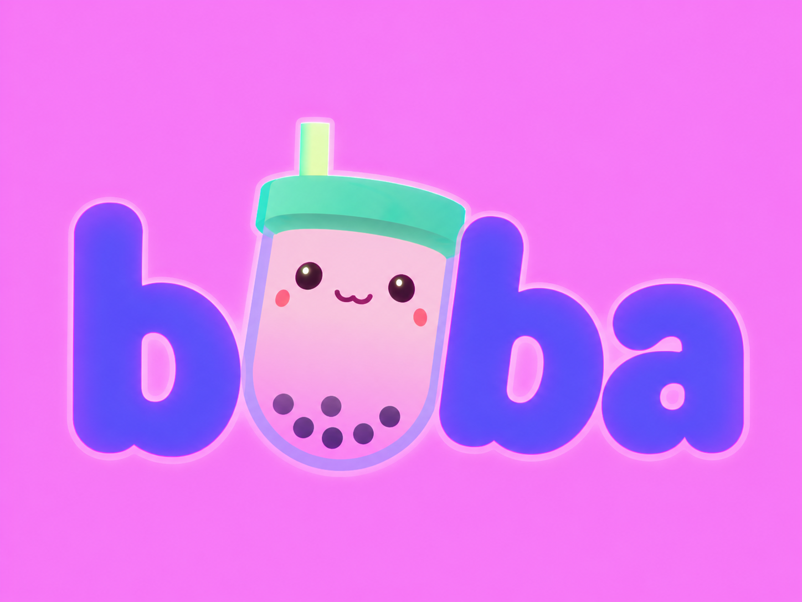

# boba - Web-based BubbleTea TUIs using libghostty

<p>
    <a href="https://btwiuse.github.io/boba/"></a>
    <a href="https://github.com/btwiuse/boba/tags"></a>
    <a href="https://pkg.go.dev/github.com/btwiuse/boba?tab=doc"></a>
    <a href="https://github.com/btwiuse/boba/blob/main/CODE_OF_CONDUCT.md"></a>
</p>

`boba` is a Golang module that facilitates embedding [BubbleTea](https://github.com/charmbracelet/bubbletea) Terminal User Interfaces (TUIs) into a Web Browser, served over HTTP with a Ghostty-powered terminal frontend.

<p>
  <table>
    <tr>
    <td style="border-right: 2px solid grey;">
<p>There are three ways to use this package:
<ul>
 <li>Compile a BubbleTea program to WebAssembly and run it entirely in the browser.</li>
 <li>Run a BubbleTea backend server and connect to it from the browser over WebSocket or WebTransport.</li>
 <li>Wrap any local CLI program in a browser terminal with the `boba` command.</li>
</ul>
    </td>
    <td ></td>
    </tr>
  </table>
</p>


## Installation

**Go** (server-side library and CLI tools):

```sh
go get github.com/btwiuse/boba
```

**npm** (TypeScript/JavaScript frontend):

```sh
npm install @btwiuse/boba
```

## How and What?

The primary enabling technologies of this are:

 * [`libghostty`](https://github.com/ghostty-org/ghostty) - Terminal emulation engine
 * [`ghostty-web`](https://github.com/coder/ghostty-web) - Web-based terminal using Ghostty's VT100 parser via WebAssembly
 * [`BubbleTea`](https://github.com/charmbracelet/bubbletea) - Terminal UI framework for Go
 * [`WebAssembly`](https://webassembly.org) - For running Go code in browsers
 * [`WebTransport`](https://developer.mozilla.org/en-US/docs/Web/API/WebTransport_API) - HTTP/3-based low-latency browser transport (with WebSocket fallback)

The name `boba` is a portmanteau of the words *Boba* and *Boo!*: the [key ingredient of Bubble Tea](https://github.com/charmbracelet/bubbletea#bubble-tea) evoking a [Ghost's exclamation of joy](https://ghostty.org).

## TypeScript API

The `BobaTerminal` class wraps ghostty-web's Terminal and provides a high-level API for embedding BubbleTea programs:

```javascript
import { BobaTerminal } from './boba/boba.js';

const boba = new BobaTerminal('terminal-container', {
    cols: 80, rows: 24, fontSize: 14,
    theme: { background: '#1e1e1e', foreground: '#d4d4d4' },
});

await boba.init();
boba.connectWebSocket('ws://localhost:8080/ws');
boba.focus();
```

`BobaTerminal` exposes methods for selection, scrollback, terminal control, mode queries, events, link detection, and custom key/wheel handlers. See [docs/TYPESCRIPT_API.md](./docs/TYPESCRIPT_API.md) for the full reference.

For adapter usage (WebSocket, WASM, custom), see [ADAPTER_USAGE.md](./ADAPTER_USAGE.md).

## Embedding a BubbleTea Application in a Web Browser

We can take entire BubbleTea applications and embed them into a Web Browser. The primary limitation is that all of its dependencies can also be compiled to WebAssembly.

### Quickstart

The top-level `boba.Run` picks the right runtime for the build target, so a single `main.go` works for both the native terminal and the browser:

```go
package main

import (
    "log"

    boba "github.com/btwiuse/boba"
)

func main() {
    if err := boba.Run(initialModel()); err != nil {
        log.Fatal(err)
    }
}
```

For easier porting from Bubble Tea — or when you need the program handle for `Send`, `Quit`, etc. — use `boba.NewProgram`:

```go
func main() {
    bp := boba.NewProgram(initialModel())
    if _, err := bp.Run(); err != nil {
        log.Fatal(err)
    }
}
```

Build and run natively with `go run ./cmd/myapp`. Build for the browser with `go run github.com/btwiuse/boba/cmd/boba-wasm-build -o web/app.wasm ./cmd/myapp/`.

For finer control, the [`wasm`](./wasm) subpackage exposes the browser bridge directly, and native code can construct a `tea.Program` the usual way.

## Web Frontend for BubbleTea-based service

Otherwise, one might have a BubbleTea program running on a remote machine. While one might use `ssh` to access it, `boba` enables an HTTP-based interface to it. The top-level `serve` package is the single server implementation for that path, serving the embedded Ghostty frontend and bridging browser clients over WebSocket or WebTransport.

### Middleware

The `serve` package exposes three composable middleware layers that mirror and extend the Wish/sip shape:

| Layer | Type | Wraps | Install |
|---|---|---|---|
| 1. Handshake | `ConnectMiddleware` | `*http.Request` for both WS upgrade and WT CONNECT | `WithConnectMiddleware(...)` |
| 2. Session I/O | `SessionMiddleware` | `Session` (transport byte streams) | `WithSessionMiddleware(...)` |
| 3. Handler | `Middleware` | `Handler` (per-session `tea.Model` construction) | `WithMiddleware(...)` |

`serve.LiftHTTPMiddleware(mw)` adapts any `func(http.Handler) http.Handler` into a `ConnectMiddleware` that runs on both the WebSocket and WebTransport handshake paths — so the full chi/gorilla/tollbooth/otelhttp ecosystem is reusable at the handshake.

Built-in middleware subpackages:

- `serve/middleware/osc52gate` — allow/deny/audit OSC 52 clipboard-write escapes in the outbound stream.
- `serve/middleware/recover` — catch panics during handler construction.
- `serve/middleware/logging` — slog-based session start/end logging.
- `serve/sipmetrics` — Prometheus counters/gauges/histogram for session lifecycle and byte throughput (isolated behind a subpackage so the main module avoids a `prometheus/client_golang` dep).

```go
srv := serve.NewServer(cfg,
    serve.WithConnectMiddleware(serve.LiftHTTPMiddleware(myHTTPMiddleware)),
    serve.WithSessionMiddleware(osc52gate.New(osc52gate.ModeDeny)),
    serve.WithMiddleware(recover.New(), logging.New()),
)
```

Basic Auth, connection limits, and `cfg.IdleTimeout` are auto-installed by `NewServer` when the corresponding `Config` fields are set.

### Config knobs

Beyond the listener/TLS/auth fields, `serve.Config` exposes protocol-safety knobs with sensible defaults:

- `MaxPasteBytes` (default 1 MiB) — cap bracketed-paste payloads from clients.
- `ResizeThrottle` (default 16ms) — debounce inbound resize messages.
- `MaxWindowDims` (default 4096×4096) — reject adversarial resize values before the PTY `ioctl`.
- `InitialResizeTimeout` (default 10s) — deadline on the initial Resize message after the handshake.
- `IdleTimeout` — close sessions with no inbound bytes for the given duration (0 = disabled).

See `docs/DESIGN_MIDDLEWARE.md` for the design rationale.

## `boba` CLI Command Wrapper

The `boba` command wraps any local CLI program and serves it in the browser through the same embedded terminal stack.

Build and run it from the repository root:

```sh
task build-cmd-boba
./bin/boba --listen 127.0.0.1:8080 -- htop
```

Everything after `--` is treated as the wrapped command and its arguments:

```sh
./bin/boba --listen 127.0.0.1:8080 -- bash
./bin/boba --listen 127.0.0.1:8080 -- python3 -q
./bin/boba --listen 127.0.0.1:8080 -- vim README.md
```

Build and run the example server from the repository root:

```sh
task build-cmd-boba-view-example-native
./bin/boba-view-example --listen 127.0.0.1:8080
```

The browser page served from `http://127.0.0.1:8080/` will use WebTransport automatically when available and fall back to WebSocket otherwise. When you provide `--cert-file` and `--key-file`, the same public port is used for HTTPS/WSS over TCP and HTTP/3 WebTransport over UDP.

### Useful flags

```sh
./bin/boba-view-example --listen 127.0.0.1:8080 --http3-port=-1
./bin/boba-view-example --listen 127.0.0.1:8080 --origin=https://app.example.com,https://*.example.net
./bin/boba-view-example --listen 127.0.0.1:8080 --cert-file=server.crt --key-file=server.key
./bin/boba-view-example --listen 127.0.0.1:8080 --username=admin --password=secret
./bin/boba-view-example --listen 127.0.0.1:8080 --username=admin --password-file=/run/secrets/boba
BOBA_PASSWORD=secret ./bin/boba-view-example --listen 127.0.0.1:8080 --username=admin
```

Notes:

 * `--http3-port=-1` disables WebTransport and uses WebSocket only.
 * the default bind address is loopback (`127.0.0.1`); non-loopback `--listen` addresses require `--cert-file` and `--key-file`.
 * browser origins are same-host by default; use `--origin` to allow additional cross-origin browser clients. Patterns are Go [`path.Match`](https://pkg.go.dev/path#Match) shell globs, **not** regex — so `*.example.com` matches one subdomain level, and `[abc]` is a character class. Patterns are tested against both `scheme://host` and the bare host.
 * Basic Auth requires `--cert-file` and `--key-file`; the server refuses to start otherwise.
 * prefer `--password-file` or `$BOBA_PASSWORD` over `--password`: the flag form leaks the secret into argv, shell history, and `ps` listings. Precedence is flag > file > env.
 * static frontend files are embedded with `go:embed`, so after frontend asset changes you must rebuild the Go binary you run.
 * reverse-proxy deployment: boba's `index.html` resolves every endpoint against `document.baseURI`, so hosting at a non-root path (e.g. nginx `location /terminal/`) works as long as the proxy **strips the prefix** before forwarding. For custom frontends, use the exported `resolveBobaURLs(document.baseURI)` helper from `@btwiuse/boba`.

## `boba-sip-client`

The `boba-sip-client` command connects to a running `boba` server and provides an interactive terminal session or dump-frames mode for diagnostics. The name comes from [sip](https://github.com/Gaurav-Gosain/sip), a tool by [@Gaurav-Gosain](https://github.com/Gaurav-Gosain) that pioneered a similar wire protocol; `boba` adopted and extended that protocol.

Build and run it:

```sh
task build-cmd-boba-sip-client
./bin/boba-sip-client ws://localhost:8080/ws
```

### WebTransport

`boba-sip-client` can dial servers over WebTransport by using an `https://` URL:

    boba-sip-client https://host:8443/wt

WebTransport uses HTTP/3 over QUIC and offers lower head-of-line-blocking latency than WebSocket. Requires the server to have HTTP/3 enabled (`serve.DefaultConfig()` enables it automatically; set `HTTP3Port: -1` to disable). For self-signed dev certs, use `--insecure-skip-verify`.

## Open Collaboration

We welcome contributions and feedback.  Please adhere to our [Code of Conduct](./CODE_OF_CONDUCT.md) when engaging our community.

 * [GitHub Issues](https://github.com/btwiuse/boba/issues)
 * [GitHub Pull Requests](https://github.com/btwiuse/boba/pulls)

## Acknowledgements

Thanks to the [Ghostty developers](https://github.com/ghostty-org/ghostty), the [ghostty-web](https://github.com/coder/ghostty-web) developers, and to [Charm.sh](https://charm.sh) for making the command line glamorous with [Bubble Tea](https://github.com/charmbracelet/bubbletea).

Thanks to [@BigJK](https://github.com/BigJk/bubbletea-in-wasm) for the initial inspiration when I was exploring this before `libghostty`.

Thanks to [@Gaurav-Gosain](https://github.com/Gaurav-Gosain), who cotemporaneously invented `sip`.  [That `sip` tool](https://github.com/Gaurav-Gosain/sip) is similar to this library, but works with `xterm.js`.   We adopted and extended its protocol and it also inspired our CLI tool.

## License

Released under the [MIT License](https://en.wikipedia.org/wiki/MIT_License), see [LICENSE.txt](./LICENSE.txt), **except** for the following files:

  * The *Booba Ghost* image, [`./etc/booba.png`](./etc/booba.png) remains **All Rights Reserved** by Neomantra Corp.  You may use it only in unmodified form and only as part of this project (e.g., in forks or distributions of the project).  You may **not** extract it for unrelated use, modify it, or redistribute it separately without explicit permission.

Copyright (c) 2026 [Neomantra Corp](https://www.neomantra.com).   

----
Made with :heart: and :fire: by the team behind [Nimble.Markets](https://nimble.markets).
